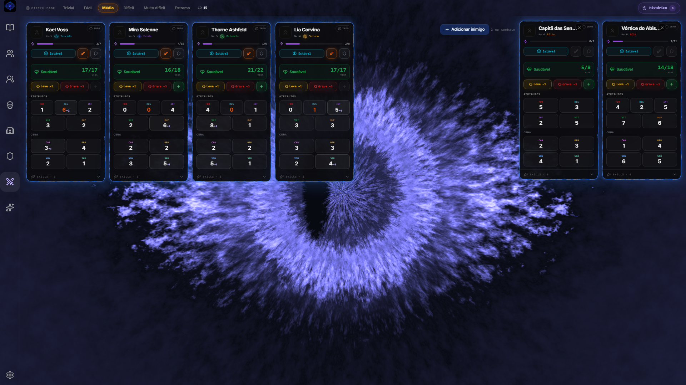
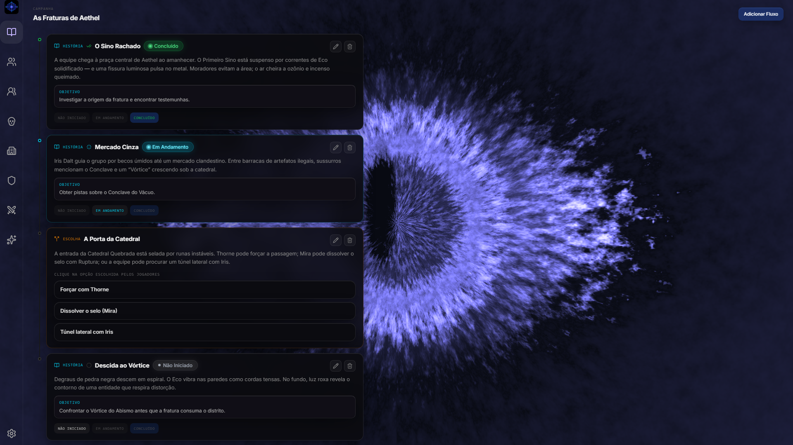
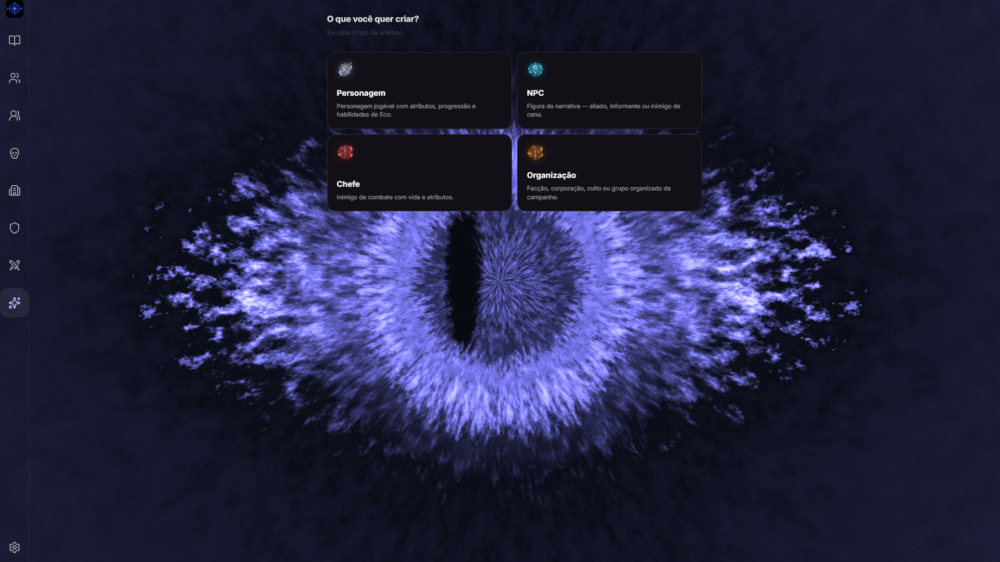
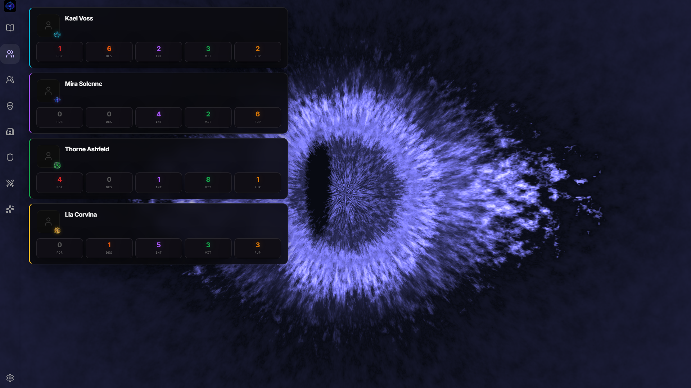
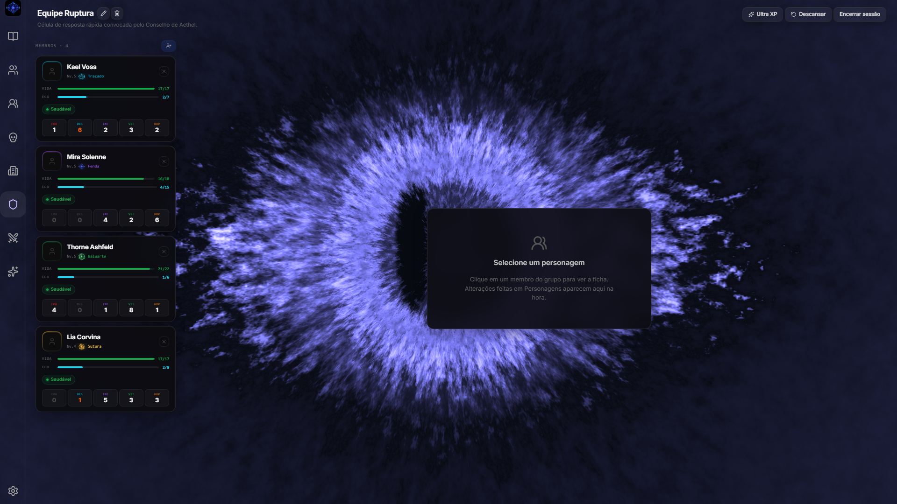
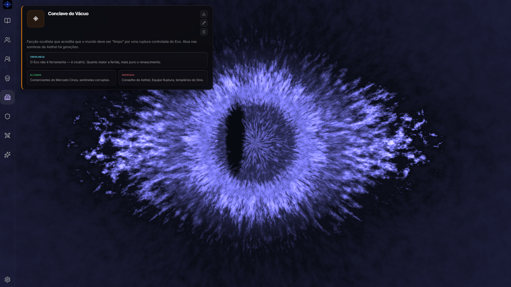

<p align="center">
  
</p>

<h1 align="center">ECOS</h1>

<p align="center">
  Sistema de RPG de mesa no navegador — campanha, fichas, combate e narrativa em um só lugar.
</p>

<p align="center">
  <a href="#-sobre">Sobre</a> ·
  <a href="#-capturas-de-tela">Screenshots</a> ·
  <a href="#-funcionalidades">Funcionalidades</a> ·
  <a href="#-stack">Stack</a> ·
  <a href="#-como-rodar">Como rodar</a>
</p>

---

## Sobre

**ECOS** é uma ferramenta web para **mestres e jogadores** conduzirem campanhas de RPG de mesa sem depender de planilhas soltas. O foco é a **experiência na mesa**: criar entidades, acompanhar a história, rolar dados, resolver combates e evoluir personagens — tudo com persistência local no navegador.

O sistema usa **marcas de vida** em vez de HP tradicional, **Eco** como recurso de skills (com sobrecarga e consequências), **cinco classes** com passivas e skills próprias, e um fluxo narrativo com **cenas e escolhas**.

Projeto pessoal / portfólio, em evolução contínua.

<p align="center">
  
  <br />
  <em>Combate com múltiplos jogadores e inimigos, skills, marcas de vida e rolagens.</em>
</p>

---

## Capturas de tela

### História e decisões

Fluxo narrativo da campanha com cenas, objetivos e escolhas com consequência.

<p align="center">
  
</p>

### Criação de entidades

Personagens, NPCs, chefes e organizações no mesmo fluxo.

<p align="center">
  
</p>

### Gestão e ficha

| Lista de personagens | Ficha — Traçado |
|:---:|:---:|
|  |  |

### Organizações

Facções com ideologia, aliados e inimigos para o mestre consultar na mesa.

<p align="center">
  
</p>

> Screenshots da campanha demo **As Fraturas de Aethel**. Para reproduzir: `Config` → **Carregar campanha demo (README)** ou importe `public/demo/ecos-demo-screenshots.json`.

---

## Funcionalidades

### Campanha e narrativa
- Campanha ativa com linha do tempo (passado, presente, futuro)
- Fluxo de **história** e **escolhas** com status (não iniciado, em andamento, concluído)
- Organizações com lore estruturado

### Personagens e entidades
- Criação guiada de personagens, NPCs, chefes e organizações
- Fichas com atributos físicos e de cena
- Equipamento (arma + armadura) com skill forjada e passivos
- Progressão por XP, pontos de atributo e investimento em **Eco** nas skills

### Classes jogáveis

| Classe | Papel |
|--------|--------|
| **Traçado** | Precisão / distância |
| **Baluarte** | Tank / linha de frente |
| **Fratura** | DPS corpo a corpo |
| **Fenda** | Controle / canal Eco |
| **Sutura** | Suporte / cura |

Cada classe traz 3 skills ativas + 1 skill da arma, passiva própria, recuos narrativos e cooldown individual.

### Combate
- Painel por personagem com borda elétrica por estado
- Marcas de dano (leve / grave) e estados corporais
- Múltiplos inimigos e bosses no mesmo combate
- Skills com custo de Eco, cooldown e histórico de rolagens
- Barra de dificuldade (CD) configurável

### Utilitários
- Rolagem de dados contextual (atributos + bônus de classe)
- Exportação de ficha (PNG / PDF)
- Import / export de campanha (JSON)
- Manuais em PDF gerados no app
- Lixeira para entidades arquivadas

---

## Stack

| Camada | Tecnologia |
|--------|------------|
| UI | [React 19](https://react.dev/) |
| Build | [Vite 8](https://vitejs.dev/) |
| Estilo | [Tailwind CSS 4](https://tailwindcss.com/) |
| Componentes | [Radix UI](https://www.radix-ui.com/), [Lucide](https://lucide.dev/) |
| Estado | [Zustand](https://zustand.docs.pmnd.rs/) |
| Animação | GSAP, Motion, OGL |
| Exportação | html-to-image, jsPDF |
| Persistência | LocalStorage (sem backend obrigatório) |

---

## Como rodar

### Pré-requisitos

- Node.js 18+ (recomendado LTS)
- npm

### Instalação

```bash
git clone https://github.com/takezo-code/sistema-rpg.git
cd sistema-rpg
npm install
```

### Desenvolvimento

```bash
npm run dev
```

Abra `http://localhost:5173` no navegador.

### Build de produção

```bash
npm run build
npm run preview
```

### Campanha demo (screenshots / testes)

```bash
# Gera o JSON em public/demo/
npm run demo:export
```

No app: **Config** → **Carregar campanha demo (README)**.

### Lint

```bash
npm run lint
```

---

## Estrutura do projeto

```text
src/
├── components/     # UI, combate, skills, equipamento, welcome
├── constants/      # classes, atributos, estados, equipamento
├── data/           # catálogo de skills por classe
├── mechanics/      # combate, eco, buffs, passivas, progressão
├── pages/          # telas principais
├── services/       # storage, save/import, PDFs, demo seed
└── store/          # Zustand (campanha, personagens, combate…)

docs/screenshots/    # imagens deste README

public/demo/        # campanha demo exportável (JSON)
```

---

## Status

MVP funcional em uso ativo. Mecânicas de classe, combate, PDFs e polish visual seguem em iteração.

---

## Autor

**takezo-code** — [github.com/takezo-code](https://github.com/takezo-code)

---

## Licença

Uso pessoal / portfólio. Consulte o repositório para detalhes de licença, se aplicável.
